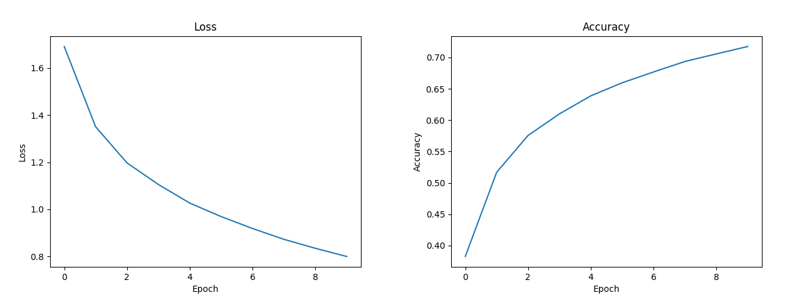
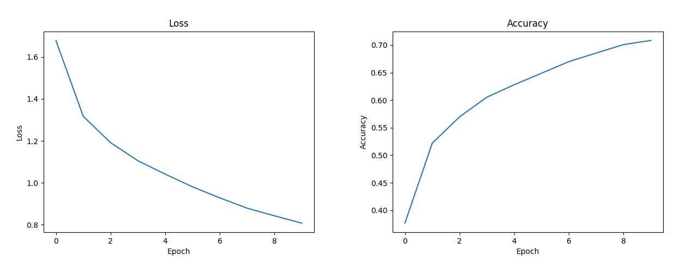
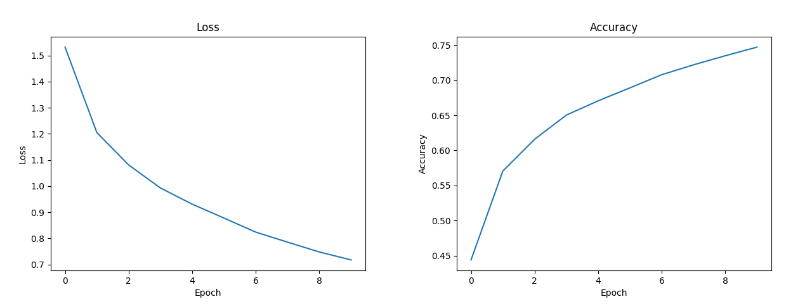
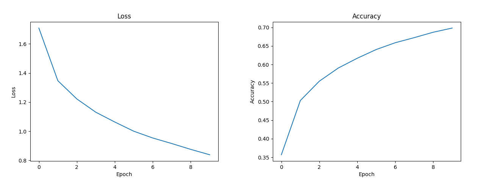

# Cifar 10 using LeNet5 and Keras

This repository has **4** different tasks performed with **LeNet5** on the **Cifar10** Dataset

* Cifar 10 Image Classification
* Cifar  9 Image Classification (dropped the last class)
* Cifar 9 where *Truck* and *Automobile* are treated as the same class
* Cifar 9 where *Truck* and *Bird* are treated as the same class

## Network


LeNet5 was introduced by [Yan LeCun](http://yann.lecun.com) back in 1998. It's a form of a convolutional network originally intented for the classification of the MNIST Dataset (Handwritten Digits).

Here I made a few changes to the network:

* *Activation Functions*: ReLu
* *Kernel Size*: 3x3

## Training

Training went on for **10** epochs with a **batch size** of 32

* *Loss Function*: Categorical Cross Entropy
* *Optimizer*: SGD

## Results

| Task                        | Loss  | Accuracy |
|-----------------------------|-------|----------|
| Cifar 10                    | 1.135 | 0.628100 |
| Cifar 9                     | 1.102 | 0.623444 |
| Cifar 9 Truck as Automobile | 1.08  | 0.655300 |
| Cifar 9 Truck as Bird       | 1.063 | 0.632900 |


#### Cifar 10



#### Cifar 9




Both **loss** and **accuracy** changed only very slighly. The training set is relatively small (In the world of *Deep Learning* that is). Theortically the network should perform better if it has less classes to distinguish, but in this case it doesn't make a big difference.

#### Cifar 9 with Truck labeled as Automobile



The **loss** went down slightly which indicates a better performance of the model, but hte difference is so small it's negelectible.

If we look at the **accuracy** we can see, that it went up by about *3%*. **Trucks** and **Automobiles** should have a lot of visual features in common so up to a certain point it makes sense to treat them as the same class and as we can see, it didn't worsen the network, but it didn't improve it that much either.

It is notworthy though that this one had the **highest accuracy** of all 4 experiments.


#### Cifar 9 with Truck labeled as Bird



Now *Trucks* and *Birds* should really have nothing in common, but surprisingly the **Loss** went down slighty and even the **accuracy** is higher when compared to the *Cifar9* version but still below the one, where **Trucks** were labeled as **Automobiles**.

I would've expected this one to perform the worst since it doesn't make sense at all to label **Trucks** as **Bids**, but surprisingly it performed on par if not even slightly better than the rest.

## Running

The implementation was done using Keras with TensorFlow as the backed. Everything you need will be installed via the *requirements.txt* file

```
pip3 install -r requirements.txt
```

You should preferably use a virtual environment.

The **Cifar10** dataset will be downloaded when you first run one of the python scripts

## References

* [Keras](https://keras.io/)
* [TensorFlow](https://www.tensorflow.org)
* [Matplotlib](https://matplotlib.org)
* [Cifar10](https://www.cs.toronto.edu/~kriz/cifar.html)
* [LeNet5](http://yann.lecun.com/exdb/lenet/)
* [Yan LeCun](http://yann.lecun.com)
* [MNIST](http://yann.lecun.com/exdb/mnist/)
